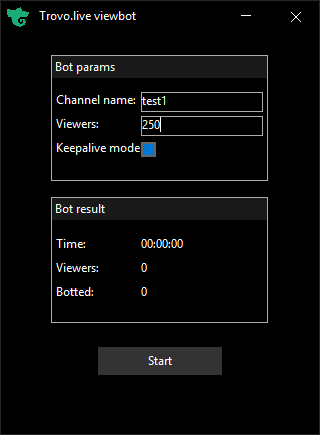

# XMT
#### Program for Trovo.live simple viewbotting. Made for learning purposes only.

# Notes
* All botted viewers are guests from your IP (no proxies required)
* Its dont work if stream is protected by authentication challenge or subscribers only mode
* If keepalive mode is ***not enabled*** program will not keep botted viewers alive and try to make as much connections until server timeout for dead guests (it was work sometime ago, now its equals to zero)

# Build
* generate `.sln` file by [premake5](https://premake.github.io/) for Visual Studio version with fully support c++14 (vs2017 or higher)
* Open `.sln` file in `build/`
* Select Release or Debug build
* Hit `Build solution`

# Contents of `src/`
`Shared` - shared code between app and modules\
`Base` - main executable app\
`Utils` - utils that used only by modules\
`Tvl` - Trovo viewbot module

# 3rd party solutions used
* Base64 - [cppbase64](https://github.com/ReneNyffenegger/cpp-base64)
* Html parser - [gumbo](https://github.com/google/gumbo-parser)
* Http parser - [llhttp](https://github.com/nodejs/llhttp)
* Javascript vm - [duktape](https://github.com/svaarala/duktape)
* Json parser - [cJSON](https://github.com/DaveGamble/cJSON)
* SHA1 - [cppsha1](https://github.com/vog/sha1)
* Websocket compression - [zlib](https://github.com/madler/zlib)
* ssl/tls - [openssl](https://github.com/openssl/openssl)
* ui - [nuklear](https://github.com/Immediate-Mode-UI/Nuklear)
* networking - [asio](https://github.com/chriskohlhoff/asio)
